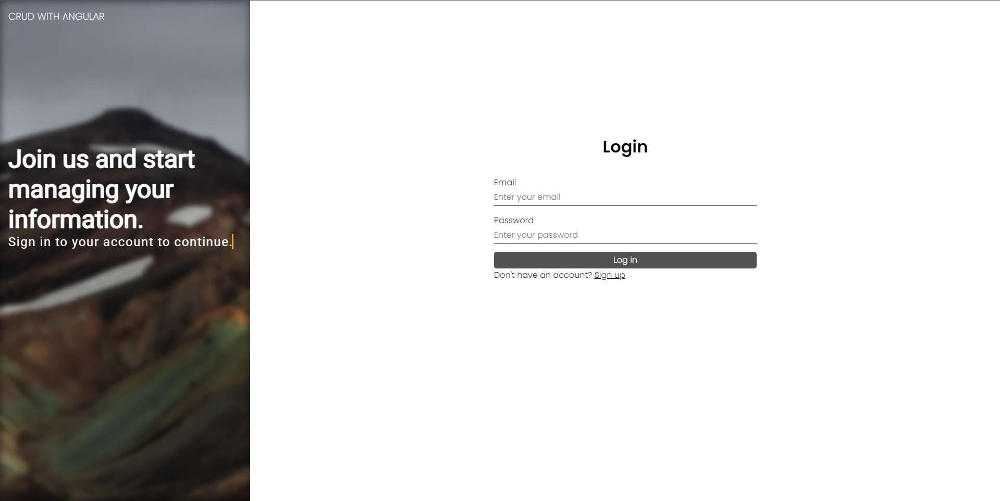
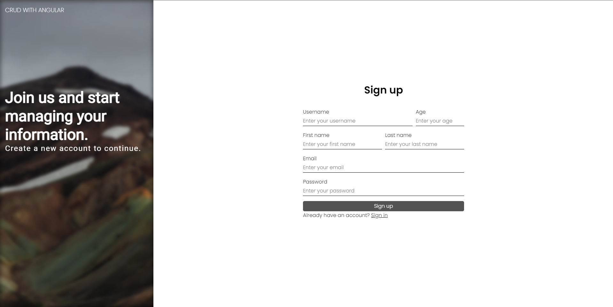

<h1>CRUD + Sistema de Login com Angular</h1>

Esse sistema de login foi criado com Angular para testar meus conhecimentos no framework, sendo abrangido no projeto rotas, serviços, guards, formulário e mais

O sistema possui um Banco de Dados fictício que utiliza o localStorage, dessa forma o deploy ocorre de forma facilitada aqui no GitHub, entretanto minha ideia é que no futuro eu integre esse sistema com um banco de dados MySQL por meio de APIs no PHP

Assim que o projeto ficar pronto, irei disponibilizar abaixo prints e um link de acesso por meio do github pages

<h3>⌛EM PROCESSO DE CONSTRUÇÃO⌛</h3>

Tela de login v1.0

Tela de cadastro v1.0

